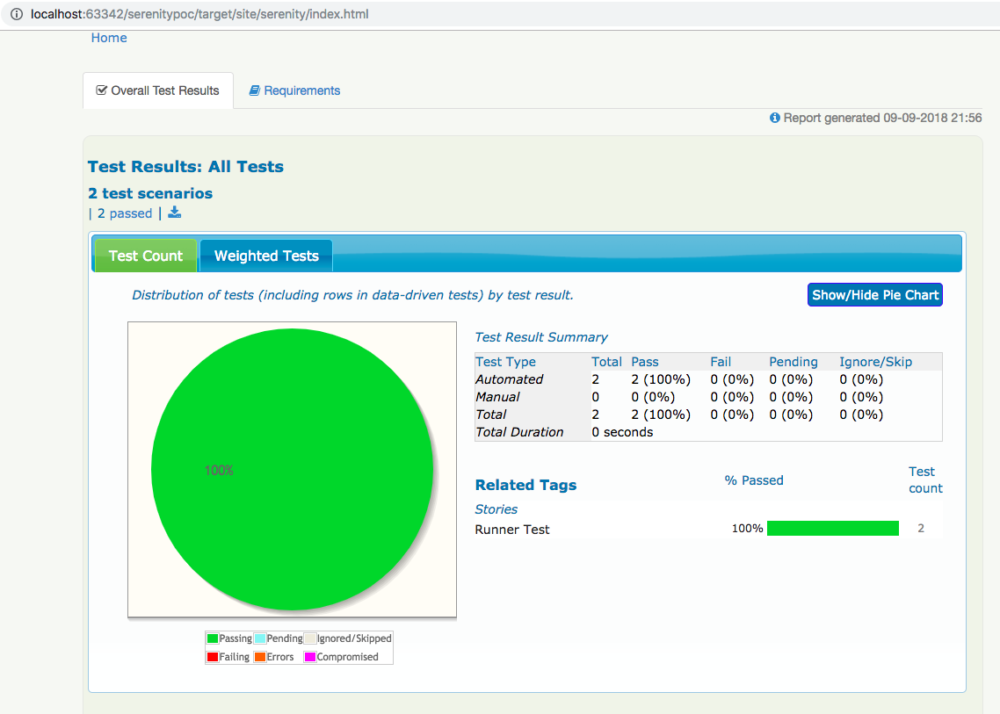
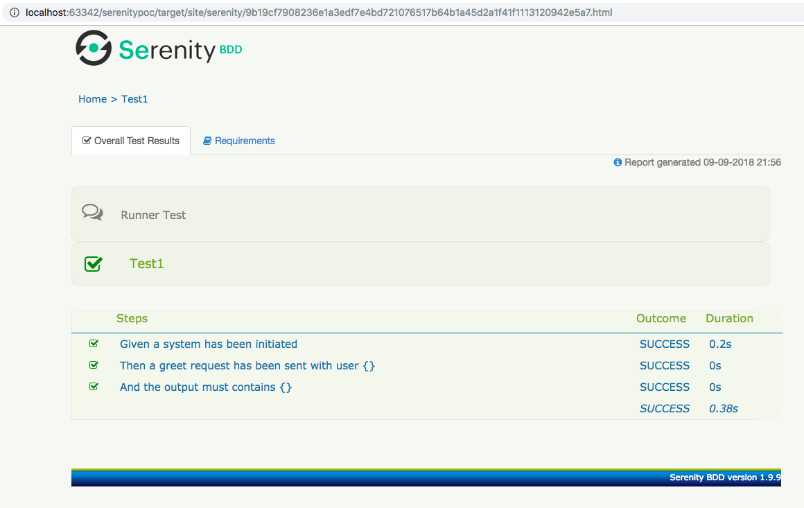

# Serenity BDD Framework.

## Reference  

 [Serenity BDD](http://www.thucydides.info/docs/serenity/)  
 
## Sample Reports. 
 
   
 
   
 
## How to run?  

  import the project as maven project to your favourite IDE.  
  
  and run ```mvn clean verify```  

## Access reports.  

   Open ```index.html``` from **target/site/serenity** directory.
 